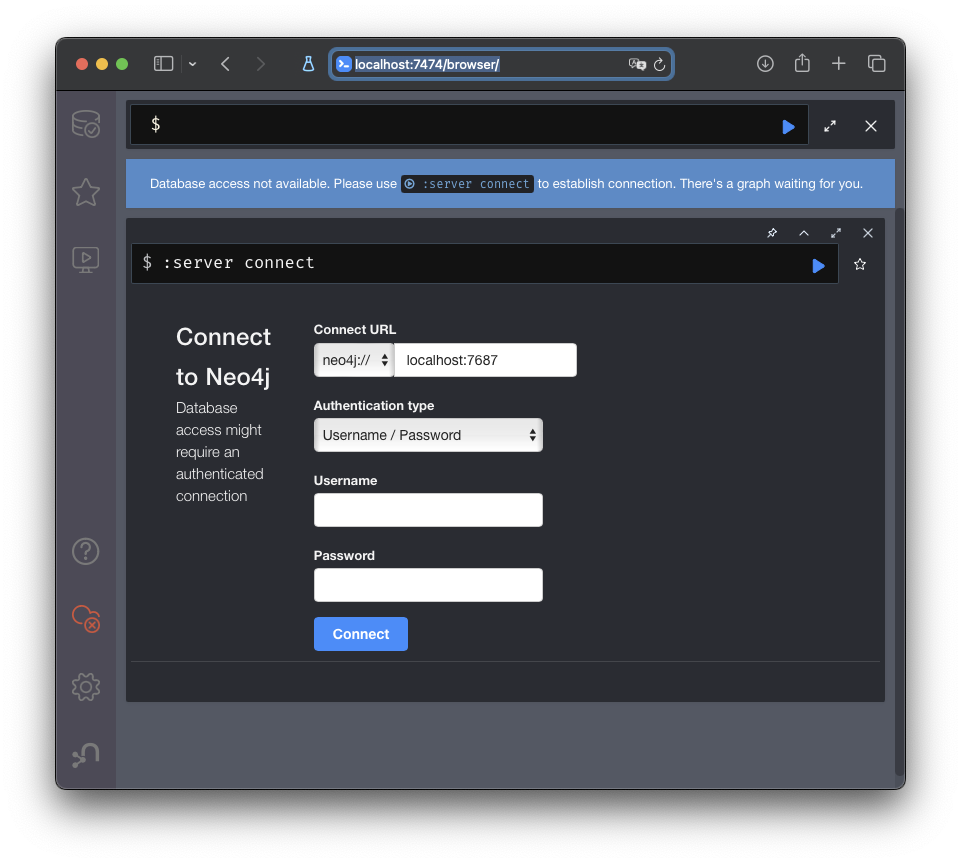

# Rapport de recomandation de jeux Steam avec Neo4j

## Auteur

- Dominique Elias (ELID14019800)

## Prérequis

Des scripts bash sont fourni pour automatiser le processus de préparation de l'environnement et du chargement des données dans Neo4j, cependant vous pouvez les consulter et les éxecuter manuellement si vous le souhaitez.

*Executez le script bash ou les commandes dans la racine du projet*

*Voici la squelette du projet initial*

```bash
.
├── README.md
├── cypher
│   ├── collaborative-filtering-game.cypher
│   ├── collaborative-filtering-user.cypher
│   ├── content-based-game.cypher
│   ├── content-based-user.cypher
│   ├── drop.cypher
│   └── recommendations.cypher
├── init.sh
├── misc
│   └── neo4j-browser.png
├── populate.sh
└── python
    ├── generate-cypher-bundles.py
    └── generate-cypher-users-items.py
```

### Étape 1 : Préparation de l'environnement

Liste des prérequis pour le script `init.sh` :

- [wget](https://www.gnu.org/software/wget/)

- [gunzip](https://www.gnu.org/software/gzip/)

- [Docker](https://docs.docker.com/get-docker/)

Lancez le script bash `init.sh` pour  télecharger les données et lancer le container Docker Neo4j.

**S'assurer que les ports 7474 et 7687 sont disponibles avant de lancer.**

```bash
chmod +x init.sh
sudo ./init.sh
```

Vérifier que le container est bien lancé en visitant [localhost:7474](http://localhost:7474).
Notez qu'aucune authentification n'est requise, donc cliquez simplement sur "Connect" pour accéder à Neo4j Browser.



### Étape 2 : Chargement des données dans Neo4j

Voici les prérequis avant de lancer le script bash `populate.sh` :

- [Python 3](https://www.python.org/downloads/)
- [cypher-shell](https://neo4j.com/docs/operations-manual/current/tools/cypher-shell/)

Installation sur Mac avec Home Brew

```bash
brew install cypher-shell
```

Installation sur Linux avec APT

```bash
wget -O - https://debian.neo4j.com/neotechnology.gpg.key | sudo apt-key add -
echo 'deb https://debian.neo4j.com stable latest' | sudo tee -a /etc/apt/sources.list.d/neo4j.list;sudo add-apt-repository -y ppa:openjdk-r/ppa;
sudo apt-get update;
sudo apt-get install neo4j -y;
``` 

La commande `cypher-shell` est importante pour pouvoir éxecuter le script bash fourni, mais n'est pas essentiel, dans le cas ou vous ne pouvez pas l'installer, Il faut executer les commandaes manuellelemnt et  copier coller les contenus des fichiers cypher dans le navigateur de Neo4j dans [localhost:7474](http://localhost:7474) et les éxecuter.

**Le script peut prendre quelques minutes avant de terminer.**

```bash
chmod +x populate.sh
./populate.sh
```

une fois le script est terminé, vous pouvez vérifier que les données ont bien été charger si le tableau suivant est affiché dans le terminal.

```bash
+----------------------------------------------------------------------------+
| RecommendedGameID | RecommendedGameName                   | MatchingGenres |
+----------------------------------------------------------------------------+
| "486340"          | "Gnarltoof's Revenge"                 | 7              |
| "473650"          | "Withering Kingdom: Arcane War"       | 7              |
| "423710"          | "Invasion: Brain Craving"             | 7              |
| "516230"          | "Withering Kingdom: Flurry Of Arrows" | 7              |
| "473640"          | "Wyatt Derp"                          | 7              |
+----------------------------------------------------------------------------+
```

Les étapes de chargement des données sont expliquées en détail dans la section [Chargement des données](#partie-2--chargement-dans-neo4j)

## Partie 1 : Données

### Origine des données

- [Jeu de données Steam](https://cseweb.ucsd.edu/~jmcauley/datasets.html#steam_data)

### Contexte

Les données concernent les jeux sur Steam. La base de données contient :

- Une liste des jeux Steam, où chaque jeu appartient à un ou plusieurs genres.
- Les utilisateurs Steam.
- La liste des jeux possédés par chaque utilisateur.
- Différents bundles de jeux disponibles à l'achat.

### Prétraitement des données

Le seul prétraitement effectué est de réduire le jeu de données `australian_users_items.json` pour obtenir un jeu de données plus petit `reduced_users_items.json` qui contient une partie des utilisateurs. Cela a été fait car le jeu de données initial est trop grand.

```bash
head -n 500 data/australian_users_items.json > data/reduced_users_items.json
```

## Partie 2 : Chargement dans Neo4j

### Modèle de données

On utilise les deux fichiers JSON `bundles_data.json` qui contient les bundles de jeux et `reduced_users_items.json` qui contient les utilisateurs et les jeux qu'ils possèdent.
Donc les données chargées dans Neo4j sont les suivantes :

- Les utilisateurs
- Les jeux
- Les bundles
- Les relations entre les utilisateurs et les jeux
- Les relations entre les bundles et les jeux

### Modification lors du chargement

- Modifications des noms des propriétés et noeuds pour une meilleure compréhension, par exemple, `item_id` devient `game_id`.

### Chargement des données

*Les données sont deja charger si vous avez suivi les étapes de préparation de l'environnement et de chargement des données. Cette section explique comment charger les données manuellement si vous le souhaitez.*

Pour charger les données dans Neo4j, on utilise le script `generate-cypher-bundles.py` et `generate-cypher-users-items.py` dans le répertoire `python` qui génère les requêtes Cypher pour charger les données dans Neo4j.

Notez que cette méthode est différente de la méthode traditionnelle avec les fichiers CSV, car les données sont stockées dans des fichiers JSON, mais leurs format ne respecte pas les règles de Syntax JSON, ils sont une version proche de la syntax de `python dictionary` mais aussi avec des différence subtile.
Donc pour contourner ce problème, on a fait des scripts python capable de lire ces fichiers et générer des requêtes Cypher pour les charger dans Neo4j.

Donc les étapes pour charger les données sont les suivantes :

*Si vous utiliser pas `cypther-shell` vous pouvez copier coller les contenus des fichiers cypher dans le navigateur de Neo4j dans [localhost:7474](http://localhost:7474) et les éxecuter.*

```bash
python3 python/generate-cypher-bundles.py

cypher-shell -f cypher/bundles.cypher > /dev/null

python3 python/generate-cypher-users-items.py

cypher-shell -f cypher/steam_users.cypher > /dev/null
```

Pour vérifier que les données ont bien été chargées, on peut exécuter une recommandation simple

```bash
cypher-shell -f cypher/recommendation.cypher
```

ou visiter [localhost:7474](http://localhost:7474) et exécuter la requête suivante :

```cypher
MATCH (g:Game {game_name: "Galactic Hitman"})-[:BELONGS_TO]->(genre:Genre)
WITH g, collect(DISTINCT genre) AS game_genres

MATCH (other_game:Game)-[:BELONGS_TO]->(genre:Genre)
WHERE genre IN game_genres AND other_game <> g

WITH other_game, count(DISTINCT genre) AS matching_genres
RETURN other_game.game_id AS RecommendedGameID, 
       other_game.game_name AS RecommendedGameName, 
       matching_genres AS MatchingGenres
ORDER BY matching_genres DESC
LIMIT 5;
```

## Partie 3 : Recommandation

Les recommondations proposées sont :

1. Proposer des jeux à un utilisateur en fonction des genres des jeux qu'il possède. (naive)
2. Proposer des jeux similaire à un jeu donné selon les genres. (index de jacard)
3. Proposer des utilisateurs similaires pour un utilisateur en fonction des jeux qu'ils possèdent en commun. (Similarite de Cosinus)
4. Proposer des jeux à un utilisateur en fonction des jeux qui appartiennent aux utilisateurs similaires. (Similarite de Pearson)

### Recommandation 1 : Proposer des jeux à un utilisateur en fonction des genres des jeux qu'il possède

Cette recommandation naive `content based` est basée sur les genres des jeux que l'utilisateur possède. On cherche les jeux qui ont le plus de genres en commun avec les jeux possédés par l'utilisateur.

```bash
cypher-shell -f cypher/content-based-user.cypher
```

```cypher
MATCH (u:User {user_id: "firefreddy"})-[:PLAYS]->(g:Game)-[:BELONGS_TO]->(genre:Genre)
WITH u, collect(DISTINCT genre) AS user_genres

MATCH (other_game:Game)-[:BELONGS_TO]->(genre:Genre)
WHERE genre IN user_genres
  AND NOT (u)-[:PLAYS]->(other_game)

WITH other_game, count(DISTINCT genre) AS genre_match_count
RETURN other_game.game_name AS RecommendedGameName, 
       genre_match_count AS MatchingGenres
ORDER BY genre_match_count DESC
LIMIT 10;
```

```bash
+--------------------------------------------------+
| RecommendedGameName             | MatchingGenres |
+--------------------------------------------------+
| "Paranormal Psychosis"          | 7              |
| "Withering Kingdom: Arcane War" | 7              |
| "Deadly Profits"                | 7              |
| "Galactic Hitman"               | 7              |
| "Wyatt Derp 2: Peacekeeper"     | 7              |
| "Wyatt Derp"                    | 7              |
| "Forsaken Uprising"             | 7              |
| "The Slaughtering Grounds"      | 7              |
| "Devils Share"                  | 7              |
| "Gnarltoof's Revenge"           | 7              |
+--------------------------------------------------+
```

### Recommandation 2 : Proposer des jeux similaire à un jeu donné selon les genres

Cette recommandation `content based` est basée sur l'index de Jaccard. On cherche les jeux qui ont le plus de genres en commun avec un jeu donné.

```bash
cypher-shell -f cypher/content-based-game.cypher
```

```cypher
MATCH (game:Game {game_name: "Galactic Hitman"})-[:BELONGS_TO]->(genre:Genre)<-[:BELONGS_TO]-(other_game:Game)
WITH game, other_game, COUNT(genre) AS intersection, COLLECT(genre.genre_name) AS i

MATCH (game)-[:BELONGS_TO]->(mg:Genre)
WITH game, other_game, intersection, i, COLLECT(mg.genre_name) AS s1

MATCH (other_game)-[:BELONGS_TO]->(og:Genre)
WITH game, other_game, intersection, i, s1, COLLECT(og.genre_name) AS s2

WITH game, other_game, intersection, s1+[x IN s2 WHERE NOT x IN s1] AS union, s1, s2
RETURN other_game.game_name AS RecommendedGameName, 
       ROUND(toFloat(intersection) / toFloat(SIZE(union)) * 1000) / 1000 AS JaccardIndex
ORDER BY JaccardIndex DESC
LIMIT 20;
```

```bash
+------------------------------------------------------+
| RecommendedGameName                   | JaccardIndex |
+------------------------------------------------------+
| "Deadly Profits"                      | 1.0          |
| "Withering Kingdom: Flurry Of Arrows" | 1.0          |
| "Gnarltoof's Revenge"                 | 1.0          |
| "Devils Share"                        | 1.0          |
| "Wyatt Derp"                          | 1.0          |
| "Withering Kingdom: Arcane War"       | 1.0          |
| "Paranormal Psychosis"                | 1.0          |
| "Wyatt Derp 2: Peacekeeper"           | 1.0          |
| "Invasion: Brain Craving"             | 1.0          |
| "The Slaughtering Grounds"            | 0.875        |
| "Forsaken Uprising"                   | 0.875        |
| "Mini Attack Submarine"               | 0.857        |
| "The Decimation of Olarath"           | 0.857        |
| "Dungeon Journey"                     | 0.857        |
| "Winged Knights: Penetration"         | 0.857        |
| "STAR-BOX: RPG Adventures in Space"   | 0.857        |
| "Waste Walkers Resource Toolkit DLC"  | 0.857        |
| "Waste Walkers Prepper's Edition DLC" | 0.857        |
| "Waste Walkers Awareness"             | 0.857        |
| "Waste Walkers Deliverance"           | 0.857        |
+------------------------------------------------------+
```

### Recommandation 3 : Proposer des recommendations d'amis pour un utilisateur en fonction des jeux qu'ils possèdent en commun

Cette recommandation `collaborative filtering` est basée sur la similarité de Cosinus. On cherche les utilisateurs similaires à un utilisateur donné en fonction du temps joué à des jeux en commun.

Noter qu'avec dans cet example de `similarité de cosinus`, on est seulement capable de trouver des utilisateurs similaires, et non pas des utilisateurs opposés, donc la similarité de cosinus est toujours positive.
Ceci est du au fait que le temps joué à un jeu ne peut pas être négatif.

```bash
cypher-shell -f cypher/collaborative-filtering-user.cypher
```

```cypher
MATCH (u1:User {user_id: "firefreddy"})-[p1:PLAYS]->(g:Game)<-[p2:PLAYS]-(u2:User)
WHERE p1.playtime_forever > 0 AND p2.playtime_forever > 0
WITH COUNT(g) AS numberOfGames, 
     SUM(p1.playtime_forever * p2.playtime_forever) AS dotProduct,
     SQRT(REDUCE(x = 0.0, a IN COLLECT(p1.playtime_forever) | x + a^2)) AS xLength,
     SQRT(REDUCE(y = 0.0, b IN COLLECT(p2.playtime_forever) | y + b^2)) AS yLength,
     u1, u2
WHERE numberOfGames > 1 AND xLength > 0 AND yLength > 0
RETURN u1.user_id AS Username,
       u2.user_id AS SimilarUsername,
       dotProduct / (xLength * yLength) AS cosineSimilarity
ORDER BY cosineSimilarity DESC
LIMIT 10;
```

*Les usernames qui sont des nombres sont des utilisateurs anonymisés*

```bash
+-----------------------------------------------------------+
| Username     | SimilarUsername     | cosineSimilarity     |
+-----------------------------------------------------------+
| "firefreddy" | "76561198093083895" | 0.9108075556069862   |
| "firefreddy" | "76561198067713802" | 0.8502514003067704   |
| "firefreddy" | "A_Je_100"          | 0.8200135071360297   |
| "firefreddy" | "76561198203244300" | 0.5996821194588051   |
| "firefreddy" | "76561198039266268" | 0.579960309318239    |
| "firefreddy" | "76561198070234207" | 0.18202642408239883  |
| "firefreddy" | "Mossy_Gaming"      | 0.002923671547024037 |
+-----------------------------------------------------------+
```

### Recommandation 4 : Proposer des jeux à un utilisateur en fonction des jeux qui appartiennent aux utilisateurs similaires

Cette recommandation `collaborative filtering` est basée sur la similarité de Pearson. On cherche les utilisateurs similaires à un utilisateur donné avec la similarité de Pearson. Ensuite on propose des jeux que ces utilisateurs possèdent et que l'utilisateur donné ne possède pas.

```bash
cypher-shell -f cypher/collaborative-filtering-game.cypher
```

D'abord on cherche les utilisateurs similaires à un utilisateur donné avec la similarité de Pearson.

```cypher
MATCH (u1:User {user_id: "firefreddy"})-[p:PLAYS]->(:Game)
WITH u1, avg(p.playtime_forever) AS u1_mean_playtime

MATCH (u1)-[p1:PLAYS]->(g:Game)<-[p2:PLAYS]-(u2)
WITH u1, u1_mean_playtime, u2, COLLECT({p1: p1, p2: p2}) AS plays WHERE size(plays) > 1

MATCH (u2)-[p:PLAYS]->(g:Game)
WITH u1, u1_mean_playtime, u2, avg(p.playtime_forever) AS u2_mean_playtime, plays
UNWIND plays AS play
WITH SUM( (play.p1.playtime_forever - u1_mean_playtime) * (play.p2.playtime_forever - u2_mean_playtime) ) AS nom,
     SQRT( SUM( (play.p1.playtime_forever - u1_mean_playtime)^2 ) * SUM( (play.p2.playtime_forever - u2_mean_playtime)^2 ) ) AS denom,
     u1, u2
WHERE denom <> 0
RETURN u1.user_id AS UserID,
        u2.user_id AS SimilarUserID,
       nom / denom AS PearsonCorrelation

ORDER BY PearsonCorrelation DESC
LIMIT 20;
```

```bash
+------------------------------------------------------------------+
| UserID       | SimilarUserID             | PearsonCorrelation    |
+------------------------------------------------------------------+
| "firefreddy" | "76561198060062487"       | 0.9999994176487216    |
| "firefreddy" | "76561197977385164"       | 0.9938488322406781    |
| "firefreddy" | "76561198093083895"       | 0.9440999725093366    |
| "firefreddy" | "76561198067713802"       | 0.9184978968949679    |
| "firefreddy" | "76561198102410011"       | 0.6614714636556526    |
| "firefreddy" | "76561198203244300"       | 0.579088341395081     |
| "firefreddy" | "76561198039266268"       | 0.5685229406668536    |
| "firefreddy" | "t8s"                     | 0.5560648296376056    |
| "firefreddy" | "76561198076909484"       | 0.5358210737855008    |
| "firefreddy" | "76561198070234207"       | 0.3756346813911443    |
| "firefreddy" | "fullswag0to100realquick" | 0.29944717437067647   |
| "firefreddy" | "76561198046844795"       | 0.25750714345249154   |
| "firefreddy" | "A_Je_100"                | 0.2562738386511623    |
| "firefreddy" | "76561198089077856"       | -0.014284256782850122 |
| "firefreddy" | "Mossy_Gaming"            | -0.41830878565562635  |
+------------------------------------------------------------------+
```

Ensuite on propose des jeux que ces utilisateurs possèdent et que l'utilisateur donné ne possède pas.

```cypher
MATCH (u1:User {user_id: "firefreddy"})-[p:PLAYS]->(:Game)
WITH u1, avg(p.playtime_forever) AS u1_mean_playtime

MATCH (u1)-[p1:PLAYS]->(g:Game)<-[p2:PLAYS]-(u2)
WITH u1, u1_mean_playtime, u2, COLLECT({p1: p1, p2: p2}) AS plays WHERE size(plays) > 1

MATCH (u2)-[p:PLAYS]->(g:Game)
WITH u1, u1_mean_playtime, u2, avg(p.playtime_forever) AS u2_mean_playtime, plays
UNWIND plays AS play
WITH SUM( (play.p1.playtime_forever - u1_mean_playtime) * (play.p2.playtime_forever - u2_mean_playtime) ) AS nom,
     SQRT( SUM( (play.p1.playtime_forever - u1_mean_playtime)^2 ) * SUM( (play.p2.playtime_forever - u2_mean_playtime)^2 ) ) AS denom,
     u1, u2
WHERE denom <> 0
WITH u1, u2, nom / denom AS PearsonCorrelation

ORDER BY PearsonCorrelation DESC
LIMIT 20
MATCH (u2:User)-[p:PLAYS]->(g:Game) WHERE NOT EXISTS( (u1)-[:PLAYS]->(g) )
RETURN g.game_name AS RecommendedGameName, 
          ROUND(SUM(PearsonCorrelation * p.playtime_forever) * 100) / 100000.0 AS Score
ORDER BY Score DESC
LIMIT 30;
```

```bash
+-----------------------------------------------------------------------+
| RecommendedGameName                                        | Score    |
+-----------------------------------------------------------------------+
| "Counter-Strike: Global Offensive"                         | 87.91517 |
| "Terraria"                                                 | 46.94379 |
| "ARK: Survival Evolved"                                    | 17.38257 |
| "Mount & Blade: Warband"                                   | 11.66768 |
| "Clicker Heroes"                                           | 9.67916  |
| "Counter-Strike: Source"                                   | 9.39456  |
| "Rocket League"                                            | 8.71449  |
| "Pirates, Vikings, & Knights II"                           | 6.22362  |
| "H1Z1: King of the Kill"                                   | 6.13562  |
| "Crusaders of the Lost Idols"                              | 5.90381  |
| "Left 4 Dead 2"                                            | 5.27952  |
| "Fallout: New Vegas"                                       | 5.07286  |
| "FTL: Faster Than Light"                                   | 5.00272  |
| "Trove"                                                    | 4.68275  |
| "Robocraft"                                                | 4.1329   |
| "Grand Theft Auto IV"                                      | 4.0165   |
| "No More Room in Hell"                                     | 3.8489   |
| "Wolfenstein: The New Order"                               | 3.83197  |
| "Borderlands 2"                                            | 3.76311  |
| "Batman™: Arkham Origins"                                  | 3.43086  |
| "Warface"                                                  | 3.34241  |
| "Portal 2"                                                 | 3.28733  |
| "Teeworlds"                                                | 3.11961  |
| "Town of Salem"                                            | 3.11063  |
| "Verdun"                                                   | 2.61405  |
| "Chivalry: Medieval Warfare"                               | 2.26042  |
| "PlanetSide 2"                                             | 2.01908  |
| "Warhammer 40,000: Dawn of War - Game of the Year Edition" | 1.95365  |
| "Warhammer 40,000: Dawn of War – Winter Assault"           | 1.54767  |
| "Starbound"                                                | 1.47947  |
+-----------------------------------------------------------------------+
```

## Pour liberer les ports, arrêter et supprimer le container lancé

```bash
sudo docker stop neo4j-container && sudo docker rm neo4j-container
```

## Références

- *Self-attentive sequential recommendation*, Wang-Cheng Kang, Julian McAuley, ICDM, 2018

- *Item recommendation on monotonic behavior chains*, Mengting Wan, Julian McAuley, RecSys, 2018

- *Generating and personalizing bundle recommendations on Steam*, Apurva Pathak, Kshitiz Gupta, Julian McAuley, SIGIR, 2017
